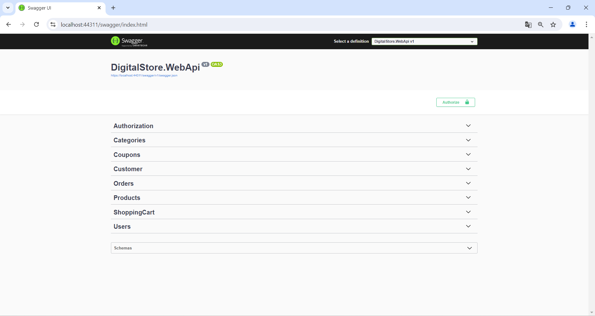
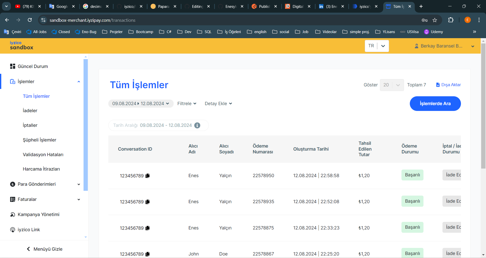

# Ppr_FinalCase_EnesYalcin WebAPI with .NET 8

This project is an e-commerce WebAPI built using ASP.NET Core 8.0, showcasing a clean architecture with a focus on maintainability, scalability, and best practices in API development.

---

## Table of Contents

1. [Introduction](#introduction)
2. [Features](#features)
3. [Technologies Used](#technologies-used)
4. [Architecture](#architecture)
5. [Setup & Installation](#setup--installation)
6. [API Documentation](#api-documentation)
7. [Contact](#contact)
8. [Images](#ımages)

---

## Introduction

The **DigitalStore WebAPI** project is a comprehensive solution for managing products, categories, orders, and users. It includes essential e-commerce features such as product catalog management, shopping cart functionality, and order processing, with robust security and user management through JWT authentication.

---

## Features

- **User Management**: Authentication and authorization using JWT.
- **Product Management**: CRUD operations for products and categories.
- **Order Processing**: Complete order lifecycle management, including order creation and order detail management.
- **Shopping Cart**: Add multiple products to the cart and manage cart details.
- **Discount Coupons**: Apply coupons for discounts on orders.
- **FluentValidation**: Robust input validation across all API endpoints.
- **Exception Handling**: Global exception handling middleware to ensure consistent error responses.
- **Logging**: Request and response logging for all API calls.

---

## Technologies Used

- **ASP.NET Core 8.0**: The foundation of the WebAPI.
- **Entity Framework Core 8.0**: ORM for database interactions.
- **MediatR**: Implementation of the CQRS pattern.
- **UnitOfWork**: Sesign pattern.
- **FluentValidation**: For input validation.
- **AutoMapper**: For object mapping.
- **Serilog**: Logging framework.
- **JWT**: For secure authentication and authorization.
- **İyzico**: For order process.
- **Swagger**: For API documentation.

---

## Architecture

The project follows a clean architecture approach, dividing the solution into multiple layers:

- **Business Layer**: Contains core business logic and manages database interactions.
- **Base Layer**: Contains base entitys and jwt managing.
- **Data Layer**: Handles use cases, Domains, and CQRS with MediatR.
- **Schema Layer**: Manage request and responses.
- **API Layer**: Exposes the API endpoints, handles requests, logging, and responses.

---

## Setup & Installation

### Prerequisites

- [.NET SDK 8.0](https://dotnet.microsoft.com/download/dotnet/8.0)
- [SQL Server](https://www.microsoft.com/en-us/sql-server/sql-server-downloads)
- [Docker](https://www.docker.com/)

### Installation

1. Clone the repository:
   ```bash
   git clone https://github.com/Enesylcn/Ppr_FinalCase_EnesYalcin
   cd Ppr_FinalCase_EnesYalcin

2. Configure the database connection string in appsettings.json:
   ```bash
   "ConnectionStrings": {
       "DefaultConnection": "Server=your-server;Database=your-database;User Id=your-username;Password=your-password;"
   }

3. Apply the migrations:
   ```bash
   dotnet ef database update

3. Run the project:
   ```bash
   dotnet run

## API Documentation

-  https://localhost:44311/swagger/index.html (Swagger)
-  https://documenter.getpostman.com/view/23429044/2sA3s4mVkx (Postman)

## Contact
For any questions, feel free to reach out:

 - Email: enesylcn57@outlook.com
 - LinkedIn: [LinkedIn](https://www.linkedin.com/in/enesyalcin57/)
 - GitHub: [GitHub](https://github.com/Enesylcn)

## Images



